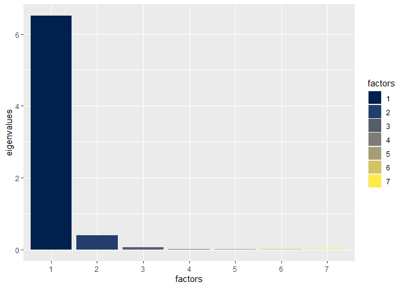

<!-- README.md is generated from README.Rmd. Please edit that file -->

# tcopula

<!-- badges: start -->

[](https://travis-ci.com/Reckziegel/tcopula)
[](https://ci.appveyor.com/project/Reckziegel/tcopula)
[](https://codecov.io/gh/Reckziegel/tcopula?branch=master)
[](https://github.com/Reckziegel/tcopula/actions)
<!-- badges: end -->

`tcopula` ports the MATLAB package [“Estimation of Structured
t-Copulas”](https://la.mathworks.com/matlabcentral/fileexchange/19751-estimation-of-structured-t-copulas?s_tid=prof_contriblnk)
into R.

## Installation

You can install the development version of `tcopula` from
[GitHub](https://github.com/) with:

``` r
# install.packages("devtools")
devtools::install_github("Reckziegel/tcopula")
```

## Case Study

Consider 7 constant maturities swap rates (`1y`, `2y`, `5y`, `7y`,
`10y`, `15y` and `30y`) from `1995-05-01` to `2005-04-21`, for a total
of 2500 daily realizations.

``` r
library(tcopula)

data("DB_SwapParRates")

Rates <- DB_SwapParRates

head(Rates, 2)
#>                 1y      2y      5y      7y     10y     15y     30y
#> 1995-05-01 0.06630 0.06858 0.07166 0.07287 0.07452 0.07612 0.07796
#> 1995-05-02 0.06586 0.06792 0.07102 0.07232 0.07413 0.07573 0.07775

tail(Rates, 2)
#>                 1y      2y      5y      7y     10y     15y     30y
#> 2005-04-20 0.03595 0.03889 0.04279 0.04445 0.04637 0.04844 0.05008
#> 2005-04-21 0.03611 0.03905 0.04295 0.04460 0.04647 0.04864 0.05037
```

In [Risk and Asset
Allocation](https://www.springer.com/gp/book/9783540222132), Meucci
shows that an absolute variation in interest-rates can be considered \~
approximately \~ “invariant” (stationary). For that reason, the
estimation process is usually carried out by taking the interest-rates
first difference:

``` r
X <- Rates[2:nrow(Rates), ] - Rates[1:nrow(Rates) - 1, ]
```

On top of that, it’s known that the first 3 principal components explain
most of the yield-curve variations (see Litterman and Scheinkman paper
[here](https://www.math.nyu.edu/faculty/avellane/Litterman1991.pdf)).

This knowledge can be used to shrink the dimension of the dataset and
avoid noisy signals from low eigenvalues that are not well defined. By
setting `K = 3` in the function `StrucTMLE`, the main sources of
relevant information (aka level, steepness and curvature) are taken into
account, while the remaining factors are assumed to follow an isotropic
structure:

``` r
K <- 3
tol <- 10 ^ (-10)

fit <- StrucTMLE(X = X, K = K, Tolerance = tol)
fit 
#> $Nu
#> [1] 49
#> 
#> $C
#>            1y        2y        5y        7y       10y       15y       30y
#> 1y  1.0000000 0.9728346 0.8947780 0.8684387 0.8281359 0.8105573 0.7479613
#> 2y  0.9728346 1.0000000 0.9560076 0.9354872 0.9000657 0.8808805 0.8107507
#> 5y  0.8947780 0.9560076 1.0000000 0.9877988 0.9729065 0.9602568 0.9049002
#> 7y  0.8684387 0.9354872 0.9877988 1.0000000 0.9850406 0.9767635 0.9330718
#> 10y 0.8281359 0.9000657 0.9729065 0.9850406 1.0000000 0.9891340 0.9627638
#> 15y 0.8105573 0.8808805 0.9602568 0.9767635 0.9891340 1.0000000 0.9755292
#> 30y 0.7479613 0.8107507 0.9049002 0.9330718 0.9627638 0.9755292 1.0000000
```

As the output shows, the commovements in interest-rates variations are
quite high. The optimal degree of freedom is \(v=50\), which may
indicate that fat-tails are not an issue for this particular dataset.

Finally, the imposed eigenvalue structure can be visualized with an
additional help from the [ggplot2](https://ggplot2.tidyverse.org/)
package.

``` r
library(ggplot2)

df <- data.frame(
  factors     = as.factor(1:7), 
  eigenvalues = eigen(fit$C)$values
) 

ggplot(data = df, aes(x = factors, y = eigenvalues, fill = factors)) + 
  geom_col() + 
  scale_fill_viridis_d(option = "E")
```



## References

Meucci, Attilio, *Estimation of Structured T-Copulas* (April 2008).
Available at SSRN: <https://ssrn.com/abstract=1126401> or
<http://dx.doi.org/10.2139/ssrn.1126401>.

Attilio Meucci (2020). [Estimation of Structured
t-Copulas](https://www.mathworks.com/matlabcentral/fileexchange/19751-estimation-of-structured-t-copulas),
MATLAB Central File Exchange. Retrieved October 14, 2020.
